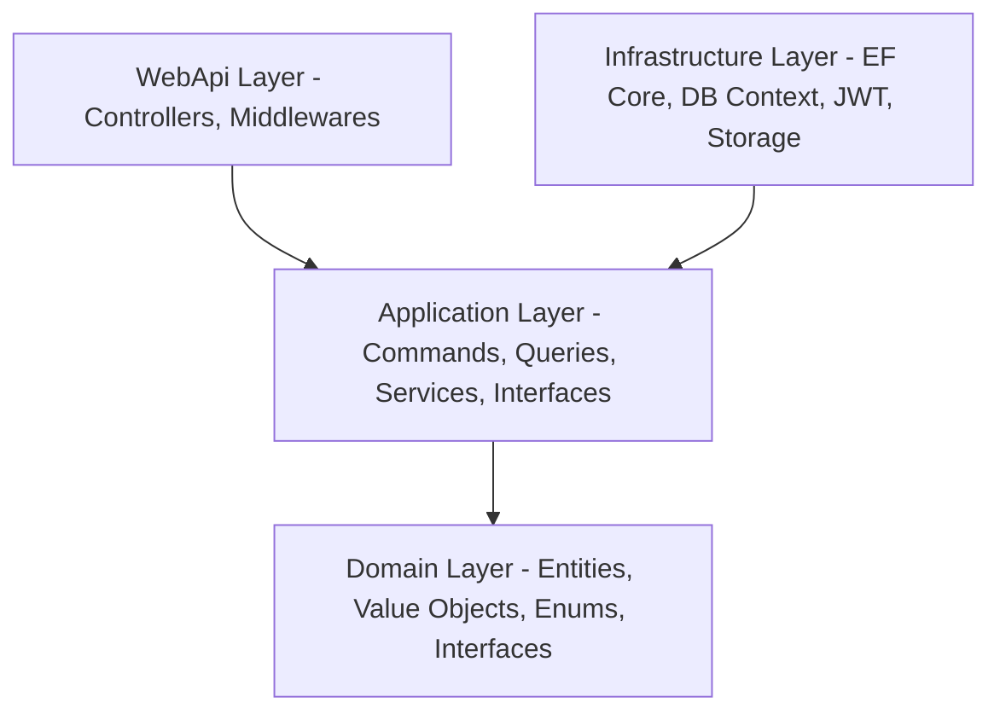

# TouristSystem — Архитектура проекта и Анализ (Фаза 1)

Этот документ описывает высокоуровневую архитектуру, роли, модули, правила разработки и структуру папок для проекта **TouristSystem**. Документ составлен в понятном стиле, подходящем для Junior-разработчиков, чтобы служить единым источником правды при дальнейшей реализации.

---

## 1. Цель Фазы 1
Цель этой фазы — спроектировать проект TouristSystem на высоком уровне. Мы определяем концепцию системы, роли пользователей, модули и структуру приложения, а также правила написания кода (Naming Conventions, DTO, валидация, обработка ошибок). 
В этой фазе **код не пишется**. Мы закладываем прочный фундамент, чтобы backend, frontend и база данных были согласованы.

---

## 2. Описание идеи проекта
**TouristSystem** (Tourist Booking System) — это современная единая туристическая платформа. Она создана для того, чтобы связать туристов с различными поставщиками туристических услуг: гидами, отелями, ресторанами и перевозчиками. 

**Основные возможности:**
*   **Для туристов:** удобный поиск достопримечательностей, отелей, ресторанов, транспорта и гидов с фильтрацией, бронирование услуг онлайн, написание отзывов и добавление мест в избранное.
*   **Для поставщиков услуг (Бизнес):** управление своими предложениями (номерами в отелях, меню ресторанов, рейсами транспорта, расписанием гидов), ведение тарифов, просмотр бронирований.
*   **Для администрации:** модерация контента (мест, отзывов), проверка документов гидов и владельцев бизнеса, просмотр системной аналитики и логов аудита.

---

## 3. Главные роли пользователей и их права
Система поддерживает 7 основных ролей:

1.  **Tourist (Турист):**
    *   *Назначение:* конечный потребитель услуг.
    *   *Права:* просмотр достопримечательностей, отелей, ресторанов, гидов и транспорта. Поиск и фильтрация. Создание бронирований. Добавление в избранное. Написание отзывов и выставление оценок. Просмотр личных бронирований и уведомлений.
2.  **Guide (Гид):**
    *   *Назначение:* локальный эксперт, предоставляющий экскурсии.
    *   *Права:* создание и редактирование профиля гида (языки, биография, цена в день). Управление своей доступностью (календарь). Просмотр и подтверждение/отклонение бронирований туристов.
3.  **HotelOwner (Владелец отеля):**
    *   *Назначение:* представитель гостиничного бизнеса.
    *   *Права:* добавление и редактирование своих отелей. Управление номерами (количество, типы, удобства, цена за ночь). Просмотр и управление бронированиями номеров.
4.  **RestaurantOwner (Владелец ресторана):**
    *   *Назначение:* представитель ресторанного бизнеса.
    *   *Права:* добавление и редактирование своих ресторанов (тип кухни, ценовой диапазон, часы работы). Управление меню или резервами.
5.  **TransportOwner (Перевозчик):**
    *   *Назначение:* поставщик транспортных услуг.
    *   *Права:* добавление транспортных средств (автобусы, такси, поезда, минивэны). Управление маршрутами (город отправления, город назначения, время отправления/прибытия, количество мест, цена за место). Управление бронированиями мест.
6.  **Admin (Администратор):**
    *   *Назначение:* модератор платформы.
    *   *Права:* модерация добавленных туристических мест (одобрение/отклонение). Модерация и удаление отзывов. Блокировка/разблокировка пользователей. Верификация гидов и владельцев бизнеса. Просмотр статистики базового дашборда.
7.  **SuperAdmin (Супер-администратор):**
    *   *Назначение:* полный контроль над системой.
    *   *Права:* все права роли Admin. Назначение и отзыв ролей Admin. Управление глобальными конфигурациями системы. Полный доступ к базе данных и логам аудита (Audit Logs).

---

## 4. Главные модули системы
Проект разбит на независимые бизнес-модули:

1.  **Authentication & Users (Авторизация и пользователи):** Регистрация, вход, JWT + Refresh Token, смена пароля, восстановление доступа, роли.
2.  **Places (Туристические места):** База достопримечательностей с описанием, координатами, фото и модерацией.
3.  **Hotels (Отели):** Управление отелями, номерами, ценами, удобствами и статусом доступности комнат.
4.  **Restaurants (Рестораны):** Каталог заведений питания, фильтрация по типу кухни, среднему чеку, управление отзывами.
5.  **Transports (Транспорт):** Расписание рейсов между городами, наличие свободных мест, покупка билетов.
6.  **Guides (Гиды):** Профили гидов, языки, опыт работы, рейтинг, часовые ставки.
7.  **Bookings (Бронирования):** Ядро бизнес-логики. Жизненный цикл заказа (Создан -> Подтвержден/Отклонен/Истек -> Завершен). Расчет стоимости.
8.  **Reviews (Отзывы):** Выставление оценок от 1 до 5 звезд, комментарии, расчет среднего рейтинга объектов.
9.  **Favorites (Избранное):** Сохранение мест, отелей и других услуг в личный кабинет туриста.
10. **Notifications (Уведомления):** Отправка системных уведомлений (бронирование подтверждено, новый отзыв и т.д.) через WebSocket (в приложении) и Email.
11. **Admin Dashboard & Reports (Панель админа и отчеты):** Графики популярности услуг, финансовые отчеты для владельцев бизнеса, аудит действий пользователей (Audit Logs).

---

## 5. Проектирование Clean Architecture
Мы используем архитектурный шаблон **Clean Architecture** (Чистая Архитектура) для C# / .NET 9. Она разделяет систему на независимые слои, где зависимости направлены исключительно внутрь (к Domain).



### Назначение каждого слоя:

1.  **Domain (Домен):**
    *   *Что внутри:* Сущности (Entities), Объекты-значения (Value Objects), Перечисления (Enums), доменные исключения и базовые контракты репозиториев (Interfaces).
    *   *Правило:* Абсолютная независимость. Никаких внешних библиотек (кроме системных), никакой привязки к базам данных (EF Core) или фреймворкам.
2.  **Application (Приложение):**
    *   *Что внутри:* Бизнес-сценарии (Use Cases), CQRS (команды `Commands` и запросы `Queries` с использованием MediatR), DTO-модели, правила валидации (FluentValidation), интерфейсы инфраструктурных сервисов (например, `IEmailService`, `IDateTimeProvider`).
    *   *Правило:* Зависит только от Domain. Содержит логику работы приложения, не зная деталей того, *как* отправляется почта или *куда* сохраняются файлы.
3.  **Infrastructure (Инфраструктура):**
    *   *Что внутри:* Реализация базы данных (EF Core DbContext, конфигурации таблиц Fluent API, миграции, репозитории), генерация JWT-токенов, реализация отправки писем, файловое хранилище (AWS S3 или локальное API), интеграции с внешними API.
    *   *Правило:* Зависит от Application и Domain. Здесь находятся детали реализации технических деталей.
4.  **WebApi (Презентационный слой / API):**
    *   *Что внутри:* Эндпоинты (Controllers / Minimal APIs), middlewares (обработка ошибок, аутентификация), настройки CORS, Swagger / OpenAPI, инициализация DI-контейнера.
    *   *Правило:* Точка входа в backend-приложение. Зависит от Infrastructure и Application.
5.  **React Client (Фронтенд):**
    *   *Что внутри:* Одностраничное приложение (SPA) на React 19 + TypeScript + Vite. UI-компоненты (Shadcn UI, Tailwind CSS), управление состоянием (Zustand), запросы к API (Axios / TanStack Query), роутинг (React Router).

---

## 6. Основные правила и стандарты проекта

### Naming Convention (Соглашение о наименовании)
*   **Backend (C#):**
    *   Классы, методы, свойства, перечисления: `PascalCase` (например, `BookingService`, `GetByIdQuery`).
    *   Локальные переменные, параметры методов: `camelCase` (например, `userId`, `bookingDate`).
    *   Приватные поля классов: `_camelCase` (например, `_dbContext`, `_dateTimeProvider`).
    *   Интерфейсы: Префикс `I` + `PascalCase` (например, `IUserRepository`).
*   **Frontend (TS / React):**
    *   Компоненты, интерфейсы, типы: `PascalCase` (например, `HotelCard`, `IUserProps`).
    *   Функции, хуки, переменные: `camelCase` (например, `useAuth`, `isLoading`).
    *   Файлы компонентов: `PascalCase` (например, `Button.tsx`).
    *   Файлы хелперов, хуков, типов: `camelCase` (например, `authService.ts`).
*   **Database (PostgreSQL):**
    *   Таблицы, колонки: `snake_case` во множественном числе для таблиц (например, `users`, `refresh_tokens`, `tourist_places`).

### Folder Structure (Структура папок)
Каждая папка внутри слоя должна отвечать строго за свою задачу. Исключается хаотичное разбрасывание файлов.

### DTO Rules (Правила передачи данных)
*   Сущности БД никогда не возвращаются наружу из API напрямую. Это нарушает безопасность и инкапсуляцию.
*   Каждый эндпоинт имеет свои DTO: Request DTO (для ввода) и Response DTO (для вывода).
*   Маппинг сущностей в DTO происходит на уровне Application с помощью `AutoMapper`.

### Validation Rules (Валидация)
*   **Двойная валидация:** на клиенте (UX) и на сервере (Безопасность).
*   **Backend:** Валидация запросов реализуется в Application слое с помощью `FluentValidation` перед выполнением бизнес-логики.
*   **Frontend:** Валидация форм на базе `React Hook Form` + `Zod`.

### Response Format (Стандарт ответа API)
Все ответы API оборачиваются в единый JSON-объект класса `ApiResponse<T>`:
```json
{
  "success": true,
  "message": "Операция выполнена успешно",
  "data": { ... },
  "errors": null,
  "statusCode": 200
}
```
В случае ошибки возвращается RFC 7807 (ProblemDetails):
```json
{
  "success": false,
  "message": "Ошибка валидации запроса",
  "data": null,
  "errors": [
    { "field": "Email", "message": "Некорректный формат почты" }
  ],
  "statusCode": 400
}
```

### Error Handling (Обработка ошибок)
*   Используется глобальный Middleware (`ExceptionHandlingMiddleware`) в WebApi слое.
*   Все непредвиденные исключения перехватываются, логируются через `Serilog` и возвращаются клиенту как 500 Internal Server Error в стандартном формате.
*   Доменные ошибки (например, `EntityNotFoundException`) преобразуются в соответствующие коды ответов (404, 400, 403) без вывода стек-трейса наружу в production.

### Authorization Rules (Авторизация и безопасность)
*   **Аутентификация:** JWT Access Token (короткий срок жизни, хранится в памяти React) + Refresh Token (длинный срок жизни, хранится в HttpOnly Secure cookie).
*   **Авторизация:**
    *   *Ролевая (RBAC):* атрибуты доступа по ролям (например, `[Authorize(Roles = "Admin")]`).
    *   *На основе политик (Policy-based):* проверка владения ресурсом. Например, редактировать отель может только его создатель (`HotelOwner` с совпадающим `OwnerId`).

---

## 7. Финальная структура Solution и Frontend папок

Ниже представлена детальная структура папок, которая будет создана при старте разработки:

### Backend Structure (C# Solution)
```
TouristSystem/
│
├── TouristSystem.sln                   # Файл решения .NET
│
├── src/
│   ├── TouristSystem.Domain/           # Слой Домена
│   │   ├── Common/                     # Базовые классы (BaseEntity, AuditableEntity)
│   │   ├── Entities/                   # Сущности (User, Place, Hotel, Room, Booking, Review, etc.)
│   │   ├── Enums/                      # Перечисления (UserRole, BookingStatus, BookingType, etc.)
│   │   ├── Exceptions/                 # Доменные исключения (DomainException)
│   │   └── Interfaces/                 # Контракты репозиториев (IUserRepository, IBookingRepository)
│   │
│   ├── TouristSystem.Application/      # Слой Приложения
│   │   ├── Common/                     # Общие модели (ApiResponse, PagedList, MappingProfile)
│   │   ├── DTOs/                       # Модели передачи данных (AuthDto, PlaceDto, BookingDto)
│   │   ├── Features/                   # Вертикальные слайсы бизнес-логики (CQRS)
│   │   │   ├── Auth/                   # Подмодуль авторизации (Commands, Queries, Handlers)
│   │   │   ├── Places/                 # Подмодуль мест (Commands, Queries, Handlers)
│   │   │   └── Bookings/               # Подмодуль бронирований (Commands, Queries, Handlers)
│   │   ├── Interfaces/                 # Интерфейсы сервисов (IDateTimeProvider, ICurrentUserService)
│   │   └── Validators/                 # Валидаторы запросов FluentValidation
│   │
│   ├── TouristSystem.Infrastructure/   # Слой Инфраструктуры
│   │   ├── Data/                       # EF Core DbContext, миграции
│   │   │   ├── Configurations/         # Конфигурации таблиц Fluent API (UserConfiguration, etc.)
│   │   │   └── Seed/                   # Первичное заполнение БД (базовые роли, админ)
│   │   ├── Repositories/               # Реализации репозиториев из Domain.Interfaces
│   │   ├── Services/                   # Реализации внешних интерфейсов (JwtService, EmailService, StorageService)
│   │   └── DependencyInjection.cs      # Регистрация зависимостей инфраструктуры
│   │
│   └── TouristSystem.WebApi/           # Презентационный слой (API)
│       ├── Controllers/                # Контроллеры API (BaseController, AuthController, PlacesController)
│       ├── Middlewares/                # ExceptionHandlerMiddleware, RequestLoggingMiddleware
│       ├── Program.cs                  # Точка запуска, конфигурация пайплайна
│       └── appsettings.json            # Настройки конфигурации разработки
```

### Frontend Structure (React App)
```
touristsystem-client/
│
├── package.json
├── tsconfig.json
├── vite.config.ts
│
├── src/
│   ├── app/                            # Настройки провайдеров и конфигураций
│   │   ├── store.ts                    # Глобальные стейты (Zustand)
│   │   └── api.ts                      # Базовый инстанс Axios с интерцепторами токенов
│   │
│   ├── assets/                         # Картинки, иконки, глобальные шрифты
│   ├── components/                     # Общие переиспользуемые UI компоненты (Button, Input, Card, Modal)
│   │
│   ├── features/                       # Слайсы функциональности
│   │   ├── auth/                       # Компоненты логина, регистрации, логика сессии
│   │   ├── hotels/                     # Карточки отелей, формы бронирования номеров
│   │   └── places/                     # Список достопримечательностей, детали места
│   │
│   ├── hooks/                          # Пользовательские хуки React (useAuth, useDebounce)
│   ├── layouts/                        # Шаблоны страниц (MainLayout, AdminLayout, OwnerLayout)
│   ├── pages/                          # Компоненты страниц (Home.tsx, Login.tsx, Bookings.tsx)
│   ├── routes/                         # Маршрутизация (AppRoutes.tsx, ProtectedRoute.tsx)
│   ├── services/                       # API-сервисы (authService.ts, hotelService.ts)
│   ├── types/                          # Описания типов TypeScript (index.d.ts, user.ts)
│   ├── utils/                          # Хелперы и утилиты форматирования (date.ts, format.ts)
│   │
│   ├── index.css                       # Глобальные стили Tailwind CSS
│   └── main.tsx                        # Точка монтирования React React19
```

---

## 8. Почему эта архитектура подходит для мирового уровня?

1.  **Слабая связанность (Loose Coupling):** За счет жесткого соблюдения зависимостей (только внутрь), каждый слой можно изменять без ущерба для остальных. Например, мы можем легко заменить PostgreSQL на MS SQL или Oracle в слое Infrastructure, не меняя ни строчки кода в Domain или Application.
2.  **Тестируемость (Testability):** Доменная логика и сценарии использования отделены от внешних инфраструктурных деталей (базы данных, внешних API). Это позволяет легко покрывать бизнес-правила Unit-тестами с использованием mock-объектов.
3.  **Масштабируемость (Scalability):** Разделение на эндпоинты, модули и использование CQRS (MediatR) позволяет команде разработчиков параллельно работать над разными фичами (слайсами) без конфликтов слияния кода.
4.  **Безопасность (Security):** Использование HttpOnly cookies для Refresh-токенов защищает от XSS-атак, а строгие роли и проверки владения ресурсами предотвращают несанкционированный доступ (BOLA/IDOR уязвимости).
5.  **Чистота кода (Clean Code):** Единый стандарт именования, структуры ответов и валидации позволяет быстро подключать новых разработчиков и поддерживать высокое качество кодовой базы.
